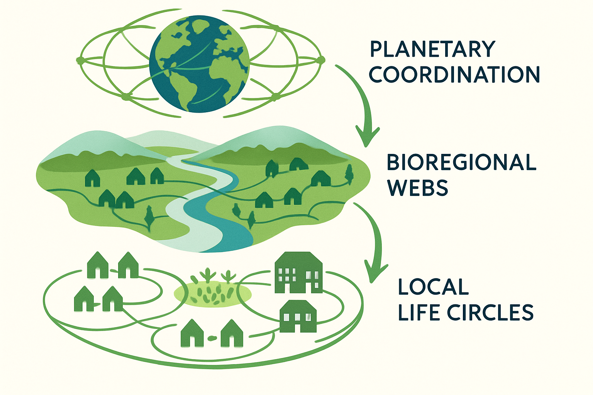

# LIFE System: Living Integrated Flow Economics

> **A comprehensive framework for regenerative economic systems that align human prosperity with ecological health through cooperative abundance.**

## 🌟 Welcome to the LIFE System

The LIFE System (Living Integrated Flow Economics) represents a fundamental reimagining of economic organization—from extractive competition to regenerative cooperation. This comprehensive documentation provides everything needed to understand, implement, and contribute to economic systems that serve life rather than extracting from it.

## 📖 Documentation Navigation

### For Everyone
- **[📋 LIFE System Overview](LIFE_System_Overview.md)** - Complete introduction for general audiences
- **[🔍 Component Analysis](component_analysis.md)** - Detailed breakdown of all system components
- **[🌍 Real-World Examples](real_world_references.md)** - Proven models and success stories

### For Builders & Implementers
- **[⚙️ Technical Implementation Guide](../technical/Technical_Implementation_Guide.md)** - Complete engineering specifications
- **[💡 Improvement Suggestions](improvement_suggestions.md)** - Enhancement recommendations
- **[🔗 Synergy Analysis](synergy_analysis.md)** - How components work together

## 🏗️ Three-Layer Architecture

### Layer 1: Local Life Circles (50-500 people)
Community-scale organization with shared resources, democratic governance, worker-owned cooperatives, and local currencies that keep wealth circulating within communities.

### Layer 2: Bioregional Webs (10,000-1,000,000 people)
Ecological boundary organization that aligns human activity with natural systems, optimizes resources across communities, and coordinates crisis response.

### Layer 3: Planetary Coordination (Global scale)
Global knowledge commons, climate response systems, resource balancing protocols, and peace frameworks that address root causes of conflict.

## 💡 Core Innovations

- **🤝 Contribution Algorithm**: Multi-dimensional framework rewarding community, ecological, knowledge, and personal contributions
- **🔒 Trust Token Protocol**: Blockchain-based reputation system making ethical behavior economically valuable
- **🔄 Anti-Hoarding Mechanisms**: Automated systems ensuring resource circulation and preventing wealth concentration
- **🌱 Regenerative Credits**: Direct economic incentives for ecological restoration
- **📚 Knowledge Commons**: Open-source innovation platform accelerating collaborative problem-solving

## 🚀 Get Started

### Readers
1. Start with the [LIFE System Overview](LIFE_System_Overview.md)
2. Explore [Real-World References](real_world_references.md)
3. Review [Component Analysis](component_analysis.md)

### Implementers
1. Read the [Technical Implementation Guide](../technical/Technical_Implementation_Guide.md)
2. Study the algorithm specifications and code examples
3. Follow deployment guides and best practices

### Contributors
1. Review our [Contributing Guidelines](../CONTRIBUTING.md)
2. Check current [Issues](https://github.com/troymork/LifeExponential/issues)
3. Join community discussions and propose improvements

## 🤝 Community & Collaboration

This project thrives on community collaboration. Whether you're interested in:
- 📝 Improving documentation
- 🔬 Contributing research
- 💻 Technical development
- 🌍 Real-world implementation
- 📢 Community building

Your contributions help build economic systems that serve life rather than extracting from it.

## 📞 Connect With Us

- **GitHub**: [troymork/LifeExponential](https://github.com/troymork/LifeExponential)
- **Issues**: [Report bugs or suggest features](https://github.com/troymork/LifeExponential/issues)
- **Discussions**: [Join community conversations](https://github.com/troymork/LifeExponential/discussions)

---

*"The LIFE System is not just an economic model—it's a framework for creating a civilization that reflects our highest values and deepest wisdom. Together, we can build economic systems that serve life rather than extracting from it."*

**⭐ [Star this repository](https://github.com/troymork/LifeExponential) if you believe in regenerative economics and cooperative abundance!**

